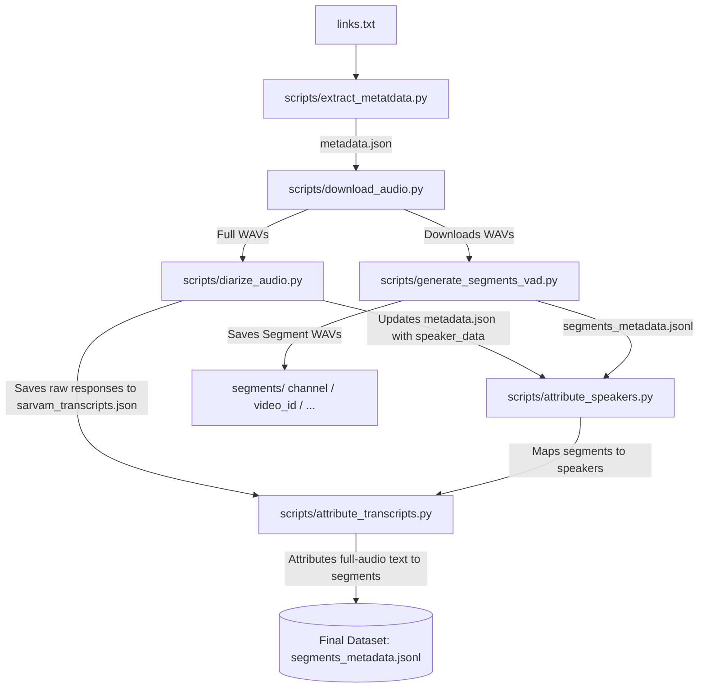

# Telugu Speech Pipeline

An automated, modular, and scalable pipeline for curating high-quality Telugu speech datasets from YouTube videos and channels. This pipeline handles the ingestion of audio, voice activity detection (VAD), speaker diarization, speaker attribution, and automatic speech recognition (ASR) transcription.

---

## Pipeline Architecture



---

## Features

- **Automated Metadata Extraction:** Extracts video metadata (ID, title, channel, duration, upload date) from individual YouTube URLs or entire channels using `yt-dlp`.
- **High-Quality Audio Acquisition:** Downloads audio streams, resamples them to **16kHz mono WAV**, and organizes them by channel.
- **Voice Activity Detection (VAD):** Employs **Silero VAD** to find speech segments, merges adjacent segments with gaps ≤ 0.5s, splits segments longer than 20.0s, and filters out segments shorter than 5.0s to optimize for TTS training.
- **Speaker Diarization & ASR:** Identifies unique speaker turn timestamps and transcribes full-length audio tracks in a single batch request using the **Sarvam Diarization & ASR APIs**.
- **Speaker & Transcript Attribution:** Intersects diarization speaker turns and transcript sentences with VAD segments using temporal overlap calculations, attributing both speakers and text without redundant API calls.

---

## Repository Structure

```directory
speech-pipeline/
├── links.txt                    # Input file containing YouTube video/channel URLs
├── README.md                    # Project documentation
├── data/
│   ├── metadata.json            # Ingested video metadata + speaker diarization timestamps
│   ├── sarvam_transcripts.json  # Raw responses from full-audio Sarvam Batch job
│   └── segments_metadata.jsonl  # VAD segments metadata, speaker mappings, and transcripts
├── audio/
│   └── [Channel_Name]/          # Full-length downloaded mono 16kHz WAV files
├── segments/
│   └── [Channel_Name]/
│       └── [Video_ID]/          # Segmented WAV files (5.0s to 20.0s)
└── scripts/
    ├── extract_metatdata.py     # YouTube metadata extractor (Note: script spelling)
    ├── download_videos.py       # Helper for expanding channel playlist URLs
    ├── download_audio.py        # YouTube audio downloader and resampler
    ├── generate_segments_vad.py # Silero VAD segment generator
    ├── diarize_audio.py         # Sarvam ASR & speaker diarization orchestrator
    ├── attribute_speakers.py    # Temporal speaker overlapping and attribution matcher
    └── attribute_transcripts.py # Maps full-audio transcript text onto VAD segments
```

---

## Installation & Setup

### 1. System Dependencies
The pipeline requires `FFmpeg` and `libsndfile` for audio decoding and processing.
```bash
# Ubuntu/Debian
sudo apt-get update && sudo apt-get install -y ffmpeg libsndfile1
```

### 2. Python Environment
Install the required Python packages:
```bash
pip install -r requirements.txt
```
*(Ensure you have packages such as `torch`, `torchaudio`, `transformers`, `sarvamai`, `silero-vad`, `yt-dlp`, `soundfile`, and `re` installed).*

### 3. Sarvam API Configuration
Diarization and Transcription require a valid Sarvam AI API Key.
1. Create a `.env` file at the project root directory.
2. Define the `SARVAM_API_KEY` in the file:
   ```env
   SARVAM_API_KEY=your_api_key_here
   ```
   Alternatively, you can export it to your environment:
   ```bash
   export SARVAM_API_KEY=your_api_key_here
   ```


---

## Step-by-Step Execution Guide

### Step 1: Collect Links
Add YouTube video URLs or Channel URLs to the `links.txt` file (one per line).

### Step 2: Extract Video Metadata & Download Audio
Run `download_audio.py` to crawl links, write metadata, and download the full audio WAVs.
```bash
python3 scripts/download_audio.py
```
- **Outputs:**
  - `data/metadata.json`
  - `audio/[Channel_Name]/[Video_Title].wav`

### Step 3: Run Voice Activity Detection (VAD)
Run the VAD script to slice full audio tracks into optimal training/testing chunks.
```bash
python3 scripts/generate_segments_vad.py
```
- **Outputs:**
  - `segments/[Channel_Name]/[Video_ID]/segment_XXXXX.wav`
  - `data/segments_metadata.jsonl`

### Step 4: Sarvam ASR & Speaker Diarization
Run full-audio transcription and speaker diarization in a single Sarvam batch job.
```bash
python3 scripts/diarize_audio.py
```
- **Outputs:**
  - Updates `data/metadata.json` with `speaker_data` turn timestamps.
  - Caches raw STT responses in `data/sarvam_transcripts.json`.

### Step 5: Attribute Speakers
Map the diarized speaker intervals to the VAD chunks using overlapping logic.
```bash
python3 scripts/attribute_speakers.py
```
- **Outputs:** Appends `dominant_speaker` and `speaker_overlap` fields to each line in `data/segments_metadata.jsonl`.

### Step 6: Attribute Transcripts
Map the full audio transcripts onto the individual VAD segment chunks using temporal overlaps.
```bash
python3 scripts/attribute_transcripts.py
```
- **Outputs:** Appends `transcript`, `language`, and `transcription_confidence` fields to `data/segments_metadata.jsonl`.

### Step 7: Quality Filtering
Apply robust TTS-centric quality filters to isolate the clean, single-speaker segments.
```bash
python3 scripts/quality_filter.py
```
- **Outputs:** Updates `data/segments_metadata.jsonl` with `quality_score`, `quality_issues`, and `speaker_purity_score`. Creates the accepted subset in `data/segments_metadata_filtered.jsonl`.

### Step 8: Emotion & Style Tagging
Apply LLM-based emotion and speaking-style classification using transcript content and video metadata.
```bash
python3 scripts/emotion_tagging.py
```
- **Outputs:** Generates `data/segments_metadata_emotions.jsonl` containing the `emotion` and `emotion_confidence` tags.

### Step 9: HTML-Based Manual Review Workflow
Generate and use a premium interactive HTML dashboard for rapid human verification.
```bash
# 1. Generate the review application and data.json
python3 scripts/generate_review_app.py

# 2. Open review/index.html in Google Chrome to inspect and audit speech segments.
#    Use keyboard shortcuts: 'A' to approve, 'R' to reject, Left/Right arrows to navigate.
#    Click 'Export Reviews (CSV)' to download 'review_results.csv'.

# 3. Apply the review results (place the downloaded CSV in the project)
python3 scripts/apply_review.py
```
- **Outputs:**
  - `review/index.html` (Interactive review tool)
  - `review/data.json` (Exported segment data)
  - `data/segments_metadata_final.jsonl` (Final approved dataset)
  - `data/segments_metadata_rejected.jsonl` (Trace of rejected segments)

### Step 10: Hugging Face Export
Convert the final reviewed dataset to Hugging Face datasets format and optionally push to the Hub.
```bash
# Export locally and optionally upload to Hub
python3 scripts/hf_export.py --push --repo user/dataset-name
```
- **Outputs:** Generates Parquet files in `datasets/tts-training-dataset_exported` and the dataset card.

### Step 11: Dataset Statistics Dashboard
Generate comprehensive json stats and a premium visual dashboard of the final dataset.
```bash
python3 scripts/dataset_statistics.py
```
- **Outputs:**
  - `data/statistics.json` (Dataset stats in JSON)
  - `data/statistics.html` (Insights dashboard report)

---

## Data Formats

### 1. `data/metadata.json` (Post-Diarization)
```json
[
  {
    "video_id": "6kPsgJHAXA0",
    "title": "Raw Talks Telugu Podcast Ep 64",
    "channel": "Raw Talks With VK",
    "duration": 5367,
    "upload_date": "20241011",
    "url": "https://www.youtube.com/watch?v=6kPsgJHAXA0",
    "audio_path": "../audio/Raw Talks With VK/podcast.wav",
    "speaker_data": {
      "SPEAKER_00": [
        { "start": 0.034, "end": 12.45 },
        { "start": 15.02, "end": 28.91 }
      ],
      "SPEAKER_01": [
        { "start": 12.45, "end": 15.02 }
      ]
    }
  }
]
```

### 2. `data/segments_metadata_final.jsonl` (Final Output Schema)
```json
{
  "video_id": "6kPsgJHAXA0",
  "channel": "Raw Talks With VK",
  "title": "Raw Talks Telugu Podcast Ep 64",
  "audio_path": "../audio/Raw Talks With VK/podcast.wav",
  "segment_path": "../segments/Raw Talks With VK/6kPsgJHAXA0/segment_00000.wav",
  "start": 0.034,
  "end": 15.034,
  "duration": 15.0,
  "dominant_speaker": "SPEAKER_00",
  "speaker_overlap": {"SPEAKER_00": 12.416, "SPEAKER_01": 2.584},
  "transcript": "నమస్కారం అండి ఈరోజు మనతో ఉన్న గెస్ట్",
  "language": "te",
  "transcription_confidence": 0.98,
  "speaker_purity_score": 0.828,
  "quality_score": 1.0,
  "quality_issues": [],
  "emotion": "conversational",
  "emotion_confidence": 0.95,
  "approved": true
}
```

### 3. Hugging Face Dataset Schema
* `audio`: `{"path": "...", "bytes": ...}`
* `transcript`: `str`
* `language`: `str`
* `speaker_id`: `str`
* `emotion`: `str`
* `speaker_purity_score`: `float`
