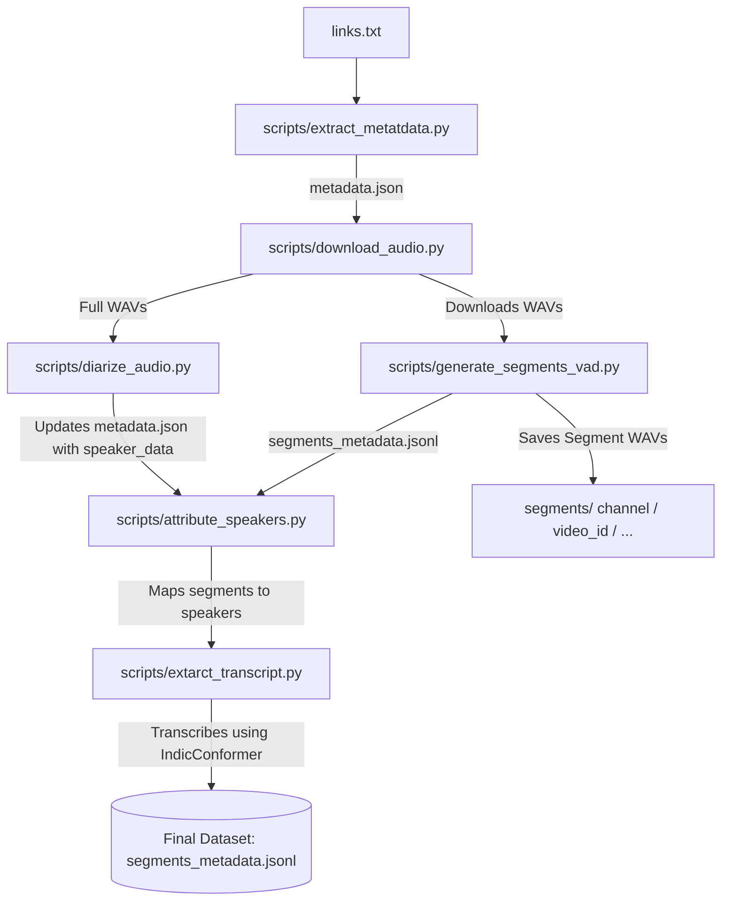

# Telugu Speech Pipeline

An automated, modular, and scalable pipeline for curating high-quality Telugu speech datasets from YouTube videos and channels. This pipeline handles the ingestion of audio, voice activity detection (VAD), speaker diarization, speaker attribution, and automatic speech recognition (ASR) transcription.

---

## Pipeline Architecture



---

## Features

- **Automated Metadata Extraction:** Extracts video metadata (ID, title, channel, duration, upload date) from individual YouTube URLs or entire channels using `yt-dlp`.
- **High-Quality Audio Acquisition:** Downloads audio streams, resamples them to **16kHz mono WAV**, and organizes them by channel.
- **Voice Activity Detection (VAD):** Employs **Silero VAD** to find speech segments, merges adjacent segments with gaps ≤ 0.5s, splits segments longer than 15s, and filters out segments shorter than 3s to optimize for ASR training.
- **Speaker Diarization:** Identifies unique speaker turn timestamps using **PyAnote Speaker Diarization 3.1**.
- **Speaker Attribution:** Intersects diarization turns with VAD segments using temporal overlap calculations to assign a `dominant_speaker` (or tag as `MIXED` / `UNKNOWN`).
- **ASR Inferences:** Transcribes the segmented audio using **AI4Bharat's IndicConformer (600M multilingual model)** with RNN-T decoding.

---

## Repository Structure

```directory
speech-pipeline/
├── links.txt                    # Input file containing YouTube video/channel URLs
├── README.md                    # Project documentation
├── data/
│   ├── metadata.json            # Ingested video metadata + speaker diarization timestamps
│   └── segments_metadata.jsonl  # VAD segments metadata, speaker mappings, and transcripts
├── audio/
│   └── [Channel_Name]/          # Full-length downloaded mono 16kHz WAV files
├── segments/
│   └── [Channel_Name]/
│       └── [Video_ID]/          # Segmented short WAV files (3s to 15s)
└── scripts/
    ├── extract_metatdata.py     # YouTube metadata extractor (Note: script spelling)
    ├── download_videos.py       # Helper for expanding channel playlist URLs
    ├── download_audio.py        # YouTube audio downloader and resampler
    ├── generate_segments_vad.py # Silero VAD segment generator
    ├── diarize_audio.py         # PyAnote speaker diarization
    ├── attribute_speakers.py    # Temporal speaker overlapping and attribution matcher
    └── extarct_transcript.py    # IndicConformer transcription script (Note: script spelling)
```

---

## Installation & Setup

### 1. System Dependencies
The pipeline requires `FFmpeg` and `libsndfile` for audio decoding and processing.
```bash
# Ubuntu/Debian
sudo apt-get update && sudo apt-get install -y ffmpeg libsndfile1
```

### 2. Python Environment
Install the required Python packages:
```bash
pip install -r requirements.txt
```
*(Ensure you have packages such as `torch`, `torchaudio`, `transformers`, `pyannote.audio`, `silero-vad`, `yt-dlp`, `soundfile`, and `re` installed).*

### 3. Hugging Face Authentication (For Speaker Diarization)
PyAnote Speaker Diarization 3.1 requires you to accept user agreements on Hugging Face before loading the model:
1. Accept the user agreement for [pyannote/speaker-diarization-3.1](https://huggingface.co/pyannote/speaker-diarization-3.1).
2. Accept the user agreement for [pyannote/segmentation-3.0](https://huggingface.co/pyannote/segmentation-3.0).
3. Generate an Access Token under your Hugging Face Account Settings.
4. Log in locally via CLI:
   ```bash
   huggingface-cli login
   ```

---

## Step-by-Step Execution Guide

### Step 1: Collect Links
Add YouTube video URLs or Channel URLs to the `links.txt` file (one per line).

### Step 2: Extract Video Metadata & Download Audio
Run `download_audio.py` to crawl links, write metadata, and download the full audio WAVs.
```bash
python3 scripts/download_audio.py
```
- **Outputs:**
  - `data/metadata.json`
  - `audio/[Channel_Name]/[Video_Title].wav`

### Step 3: Run Voice Activity Detection (VAD)
Run the VAD script to slice full audio tracks into optimal training/testing chunks.
```bash
python3 scripts/generate_segments_vad.py
```
- **Outputs:**
  - `segments/[Channel_Name]/[Video_ID]/segment_XXXXX.wav`
  - `data/segments_metadata.jsonl`

### Step 4: Speaker Diarization
Run speaker diarization on the full audio files to identify who spoke when.
```bash
python3 scripts/diarize_audio.py
```
- **Outputs:** Updates `data/metadata.json` with the `speaker_data` field mapping speaker names to turn timestamps.

### Step 5: Attribute Speakers
Map the diarized speaker intervals to the VAD chunks using overlapping logic.
```bash
python3 scripts/attribute_speakers.py
```
- **Outputs:** Appends `dominant_speaker` and `speaker_overlap` fields to each line in `data/segments_metadata.jsonl`.

### Step 6: Transcribe Audio Chunks
Generate Telugu RNN-T transcriptions for the segments.
```bash
python3 scripts/extarct_transcript.py
```
- **Outputs:** Appends the final `transcript` text field to `data/segments_metadata.jsonl`.

---

## Data Formats

### 1. `data/metadata.json` (Post-Diarization)
```json
[
  {
    "video_id": "6kPsgJHAXA0",
    "title": "Raw Talks Telugu Podcast Ep 64",
    "channel": "Raw Talks With VK",
    "duration": 5367,
    "upload_date": "20241011",
    "url": "https://www.youtube.com/watch?v=6kPsgJHAXA0",
    "audio_path": "../audio/Raw Talks With VK/podcast.wav",
    "speaker_data": {
      "SPEAKER_00": [
        { "start": 0.034, "end": 12.45 },
        { "start": 15.02, "end": 28.91 }
      ],
      "SPEAKER_01": [
        { "start": 12.45, "end": 15.02 }
      ]
    }
  }
]
```

### 2. `data/segments_metadata.jsonl` (Final Output)
```json
{"video_id": "6kPsgJHAXA0", "channel": "Raw Talks With VK", "title": "Raw Talks Telugu Podcast Ep 64", "audio_path": "../audio/Raw Talks With VK/podcast.wav", "segment_path": "../segments/Raw Talks With VK/6kPsgJHAXA0/segment_00000.wav", "start": 0.034, "end": 15.034, "duration": 15.0, "dominant_speaker": "SPEAKER_00", "speaker_overlap": {"SPEAKER_00": 12.416, "SPEAKER_01": 2.584}, "transcript": "నమస్కారం అండి ఈరోజు మనతో ఉన్న గెస్ట్"}
```

---

## Future Roadmap

### 1. Transcription Quality
- **Multi-ASR Evaluation:** Benchmark and compare output transcripts across `ai4bharat/indic-conformer-600m-multilingual`, OpenAI Whisper models (e.g., `whisper-large-v3`), Sarvam ASR APIs, and emerging Telugu ASR models.
- **Telugu-English Code-Mixed Support:** Integrate and fine-tune models specialized in handling bilingual, code-mixed Telugu-English conversation structures commonly present in urban podcasts.

### 2. Metadata Enrichment
- **Emotion Classification:** Deploy Speech Emotion Recognition (SER) models (e.g., Wav2Vec2 fine-tuned on emotion datasets) to append sentiment and emotional context tags to segments.
- **Speaking-Style Tagging:** Automate categorization of speaking styles (conversational, formal debate, whisper, shouting, humor).
- **Topic Modeling:** Apply NLP/LLM-based topic classifiers over transcripts to auto-tag segments with domains (e.g., Politics, Food, Comedy, Tech).
- **Language & Dialect ID:** Detect regional Telugu dialects (Telangana, Andhra, Rayalaseema) and measure English code-mixing percentages.

### 3. Production Pipeline
- **Parallel Processing:** Implement distributed batch downloading and processing frameworks 
- **Streaming JSONL Engine:** Refactor data handlers to use generator streams for processing millions of audio segment metadata rows without memory bottlenecks.
