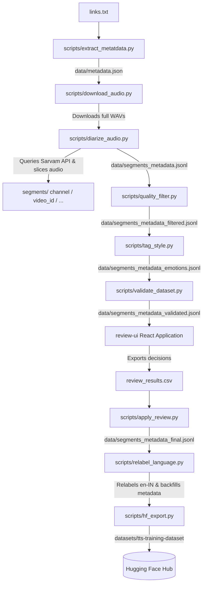

# Multilingual Telugu-English Speech Pipeline

An automated, modular, and scalable pipeline for curating high-quality Telugu and English speech datasets from YouTube videos and channels. This pipeline handles metadata ingestion, audio downloading/resampling, automatic speech recognition (ASR) transcription, speaker diarization, quality filtering, speaker style and emotion classification, manual human review, and exporting directly to the Hugging Face Hub.

Instead of traditional Voice Activity Detection (VAD) tools like Silero, this pipeline utilizes native segment boundaries returned by the **Sarvam Cloud Diarization & Transcription API**, optimizing audio segmentation for TTS and ASR training.

---

## Pipeline Architecture



---

## Features

- **Automated Metadata Extraction:** Extracts video metadata (ID, title, channel, duration, upload date) from YouTube URLs or entire channel playlists using `yt-dlp`.
- **High-Quality Audio Acquisition:** Downloads audio streams, resamples them to **16kHz mono WAV**, and organizes them by channel.
- **Native Segment Boundaries:** Uses diarization speaker turns and ASR boundaries from the **Sarvam ASR & Diarization Batch API** to segment files into optimal TTS training durations (5.0s to 15.0s), avoiding external VAD dependencies like Silero.
- **Quality Filtering:** Applies strict duration boundaries, transcript length constraints, and speaker checks to purge low-quality audio candidates.
- **LLM-Based Emotion & Style Tagging:** Categorizes speaking style and emotion for each audio segment using the Sarvam 30B LLM API.
- **Strict Dataset Validation:** Formats and validates the schema, asserting correct metadata lineage (`video_id`, `youtube_url`, `channel_name`, `video_title`), repetition rules, and speaker constraints.
- **Manual Review Workstation:** Serves audio segments locally and opens a React-based review platform featuring a virtualized list, waveform visualizations, and keyboard hotkeys to accelerate human inspection.
- **Hugging Face Hub Integration:** Packages the final corpus in the Hugging Face datasets format and pushes it directly to the Hub.

---

## Repository Structure

```directory
speech-pipeline/
├── links.txt                    # Input file containing YouTube URLs (one per line)
├── README.md                    # Project documentation
├── requirements.txt             # Python dependencies
├── main.py                      # Orchestrator CLI to run the entire pipeline
├── run_app.sh                   # Script to run local servers for the Review UI
├── data/
│   ├── metadata.json            # Ingested video metadata + speaker diarization timestamps
│   ├── sarvam_transcripts.json  # Raw responses from full-audio Sarvam Batch job
│   ├── segments_metadata.jsonl  # Raw diarized segments metadata and transcripts
│   ├── segments_metadata_filtered.jsonl # Filtered segments after quality checks
│   ├── segments_metadata_emotions.jsonl # Segments with style & emotion tagging
│   ├── segments_metadata_validated.jsonl # Validated segments metadata
│   ├── segments_metadata_final.jsonl # Final approved segments after review
│   └── segments_metadata_rejected.jsonl # Rejected/unreviewed segments after review
├── audio/
│   └── [Channel_Name]/          # Full-length downloaded mono 16kHz WAV files
├── segments/
│   └── [Channel_Name]/
│       └── [Video_ID]/          # Segmented WAV files (5.0s to 15.0s)
├── review-ui/                   # React + TypeScript + Tailwind CSS manual review web app
└── scripts/
    ├── extract_metatdata.py     # YouTube metadata extractor using yt-dlp
    ├── download_audio.py        # YouTube audio downloader and resampler
    ├── diarize_audio.py         # Sarvam ASR & diarization runner, segments slicer
    ├── quality_filter.py        # Checks durations, transcript lengths, and speakers
    ├── tag_style.py             # Tags emotion and style using Sarvam 30B LLM
    ├── validate_dataset.py      # Checks dataset format and semantic constraints
    ├── relabel_language.py      # Utility to relabel English segments and backfill metadata
    ├── apply_review.py          # Applies manual review decisions from review_results.csv
    ├── hf_export.py             # Prepares and pushes dataset to Hugging Face Hub
    └── dataset_statistics.py    # Generates final dataset statistics and HTML dashboard
```

---

## Installation & Setup

### 1. System Dependencies
The pipeline requires `FFmpeg` and `libsndfile` for audio decoding and processing.
```bash
# Ubuntu/Debian
sudo apt-get update && sudo apt-get install -y ffmpeg libsndfile1
```

### 2. Python Environment
Install the required Python packages:
```bash
pip install -r requirements.txt
```

### 3. API & Authentication Configuration
The pipeline uses environment variables for authentication. Create a `.env` file at the project root directory:

```env
SARVAM_API_KEY=your_sarvam_api_key_here
HF_TOKEN=your_huggingface_write_token_here
```

* **`SARVAM_API_KEY`**: Required for speaker diarization, ASR transcription, and style/emotion classification.
* **`HF_TOKEN`**: Required to authenticate with the Hugging Face Hub when exporting/pushing datasets.

---

## Step-by-Step Execution Guide

You can run the entire pipeline end-to-end or run specific steps using the CLI orchestrator `main.py`.

```bash
# Run the complete pipeline end-to-end
python3 main.py

# Run only a specific step (1-7)
python3 main.py --step 3

# Run the pipeline starting from step N
python3 main.py --from 4
```

### Orchestrator Pipeline Steps (1-7):

#### Step 1: Metadata Ingestion
Reads YouTube links from `links.txt` and extracts video metadata.
```bash
python3 scripts/extract_metatdata.py
```
- **Outputs:** `data/metadata.json`

#### Step 2: Audio Download
Downloads full-length WAV audio files and resamples them to 16kHz mono.
```bash
python3 scripts/download_audio.py
```
- **Outputs:** Full WAV files in `audio/[Channel_Name]/`

#### Step 3: Sarvam ASR & Diarization
Triggers the Sarvam Batch STT & Diarization job. It utilizes the natively returned word/sentence boundaries to slice the full audio tracks into segment WAV files and generates the segments metadata.
```bash
python3 scripts/diarize_audio.py
```
- **Outputs:**
  - Segment WAV files in `segments/[Channel_Name]/[Video_ID]/`
  - Raw diarized segments metadata in `data/segments_metadata.jsonl`
  - Caches API response in `data/sarvam_transcripts.json`

#### Step 4: Quality Filtering
Removes candidate segments failing quality check metrics (e.g. durations < 2.0s or > 30.0s).
```bash
python3 scripts/quality_filter.py
```
- **Outputs:** `data/segments_metadata_filtered.jsonl`

#### Step 5: Emotion & Style Tagging
Queries the Sarvam 30B LLM to tag speaking style (conversational, educational, etc.) and emotion (neutral, happy, excited, etc.).
```bash
python3 scripts/tag_style.py
```
- **Outputs:** `data/segments_metadata_emotions.jsonl`

#### Step 6: Dataset Validation
Runs validation checks verifying duration bounds, unique keys, and metadata schemas.
```bash
python3 scripts/validate_dataset.py
```
- **Outputs:** `data/segments_metadata_validated.jsonl`

#### Step 7: Hugging Face Export
Prepares datasets, compiles splits (e.g., `balanced_60min` and `full_accepted`), and pushes them to the Hugging Face Hub.
```bash
python3 scripts/hf_export.py --push --repo user/dataset-name
```
- **Outputs:** Parquet splits and the Hugging Face dataset card.

---

## Manual Review Workflow

To perform human verification on generated segment candidates:

### 1. Launch Review Workstation
Run the script from the root directory to start the audio static server and React UI:
```bash
./run_app.sh
```
- **Audio Server:** Runs on port `8080` to stream segments to the browser.
- **Review UI:** Runs Vite development server on port `5173`. Open `http://localhost:5173` in your browser.

### 2. Perform Reviews
- Drag-and-drop the generated `segments_metadata_emotions.jsonl` or `segments_metadata_validated.jsonl` file into the `/data` page of the UI.
- Navigate to the review screen (`/`) and audit the segments using keyboard hotkeys (`A` to approve, `R` to reject, `T` to edit transcripts, etc.).
- When finished, go back to `/data` and export the decisions to a CSV named `review_results.csv`. Place this file at the project root.

### 3. Apply Decisions
Apply the manual review CSV file back onto the metadata entries:
```bash
python3 scripts/apply_review.py
```
- **Outputs:** 
  - `data/segments_metadata_final.jsonl` (approved entries)
  - `data/segments_metadata_rejected.jsonl` (rejected entries)

### 4. Language Relabeling & Metadata Backfill
Relabel pure English segments in the approved dataset to `"en-IN"` (using language detection on the transcription), keeping Telugu and code-mixed segments as `"te"` or `"te-IN"`, and backfill necessary source metadata before final export.
```bash
python3 scripts/relabel_language.py
```
- **Outputs:** Updates language fields and ensures metadata lineage.

---

## Data Formats

### 1. `data/segments_metadata_final.jsonl` (Final Output Schema)
```json
{
  "video_id": "6kPsgJHAXA0",
  "youtube_url": "https://www.youtube.com/watch?v=6kPsgJHAXA0",
  "channel_name": "Raw Talks With VK",
  "video_title": "Raw Talks Telugu Podcast Ep 64",
  "segment_path": "../segments/Raw Talks With VK/6kPsgJHAXA0/segment_00000.wav",
  "start": 0.034,
  "end": 15.034,
  "duration": 15.0,
  "speaker_id": "SPEAKER_00",
  "transcript": "నమస్కారం అండి ఈరోజు మనతో ఉన్న గెస్ట్",
  "language": "te",
  "style": "conversational",
  "emotion": "neutral",
  "approved": true
}
```

### 2. Hugging Face Dataset Splits Schema
* `audio`: `{"path": "...", "bytes": ...}`
* `transcript`: `str` (corrected transcript)
* `language`: `str` ("te-IN" or "en-IN")
* `speaker_id`: `str`
* `style`: `str`
* `emotion`: `str`
* `video_id`: `str`
* `youtube_url`: `str`
* `channel_name`: `str`
* `video_title`: `str`
* `rejection_reason`: `str` (only present in the `rejected` split)
* `notes`: `str` (only present in the `rejected` split)
